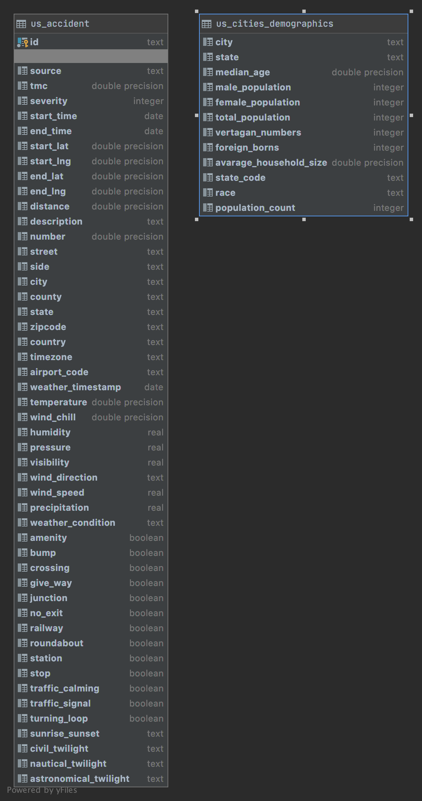

# Capstone Project
* NOTE: I removed the datasets because it's too big compared to 500MB of the Udacity's limit submition size. 
## Introduction

This project is the capstone project Udacity Data Engineering Nanodegree.

## Data sets
Two data sets is US Accident and US cities Demographic. Both of them download from Kaggle

## Purpose:
* Provide data for related authorities about what factors lead to accident and various factors relate to this.
* The authorities can use this data to have some solutions to limit accidents happened

## The end solution:
Analyze the accients in the US in various aspect e.g. weather, population of that area.

## Tools:
* PostgresSQL
* Airflow

- Reason: 
    * These tools simple and can handle these datasets.
    * Fast to implement
    * Don't need to host it in some services such as EMR, Redshift (Because my AWS credit run out)
    * Easy to debug and monitor

## Data model
* The most used query is SELECT because the purpose of this project is analysing.    
* The fetched data will related to the factors which relate to the accidents.

# Schema of final data model

## Steps:
* Cleaning: These datasets have already cleaned. So I skip this step

1. Begin execution
2. Run create and copy each table parallel (ETL process)
3. Check data quality

## The ETL processes result:
Example:
* Extract data for "What time was the accidents happen?"
* Extract data for "What weather was the accidents happen?"
* Analyse what is the most kind of accidents e.g. in junction, turning point

## Address assuming scenarios:
1. If the data was increased by 100x:
    * Data sets' size increase to 200Gb. So we remain the current solution, the bottle neck will happen. Because the bigger size database will need more time more resources (Ram, CPU) to process.
    * We can host it in EMR or Redshift which allow us expand our resource to process it

2. The pipelines would be run on a daily basis by 7 am every day
    * We can schedule Airflow to do it. Airflow allow us set it to be a routine tasks 

3. If the database needed to be accessed by 100+ people:
    * The more users will bring the more cpu resource to keep a good experience.
    * Switch to use NoSQL solution. Because the NoSQL will bring the faster query performance for each
  
    
 